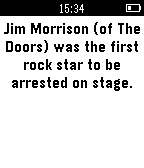

# Daily Quotes [v1.0]
***

`Daily Quotes` is a simple app that displays a quote on your pebble smart watch. Press any button to refresh the quote.

### Screenshots of the App Store Listing

### Sample Quotes

### Usage

- Option 1: Search "Daily Quotes" in the Pebble app store and download it.
- Option 2: Download the pbw from the build folder and sideload.
- Option 3: Compile from source.

### FAQ

> Where do the quotes come from?

http://www.iheartquotes.com/api/

> How do I get a new quote?

Click any of the up, select, or down buttons and a new quote will appear.

#### Links

- [Pebble App Store listing](https://apps.getpebble.com/applications/54e8fa6f448dcd40540000a7)
- [Source Code](https://github.com/issmirnov/Pebble-DailyQuote)
- [Challenge Post](http://treehackswinter2015.challengepost.com/submissions/33092-daily-quote)

#### Contributors
Ivan Smirnov (http://ivansmirnov.name)
